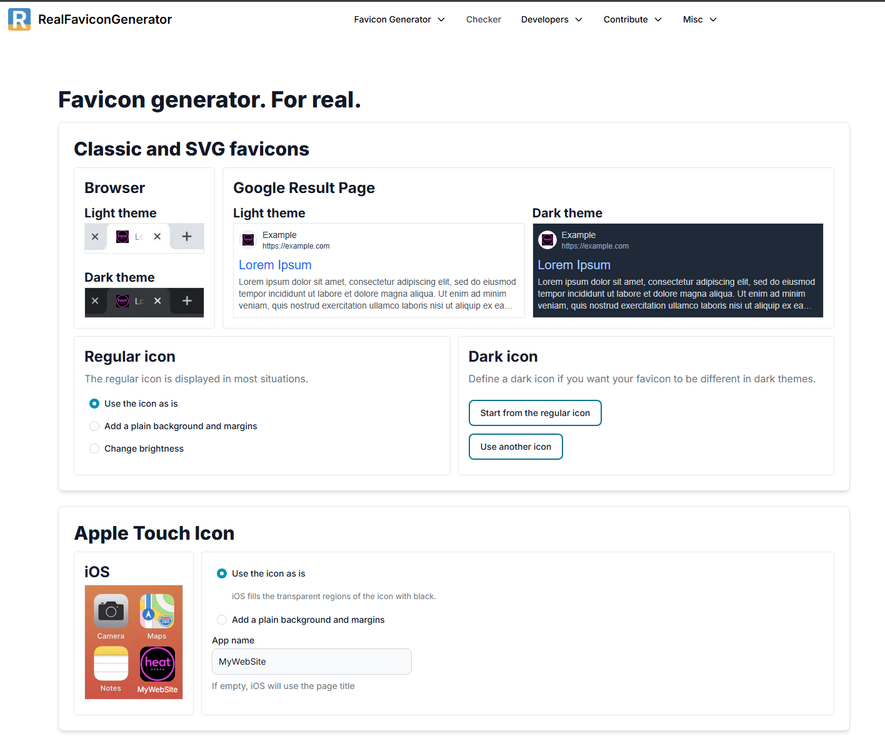
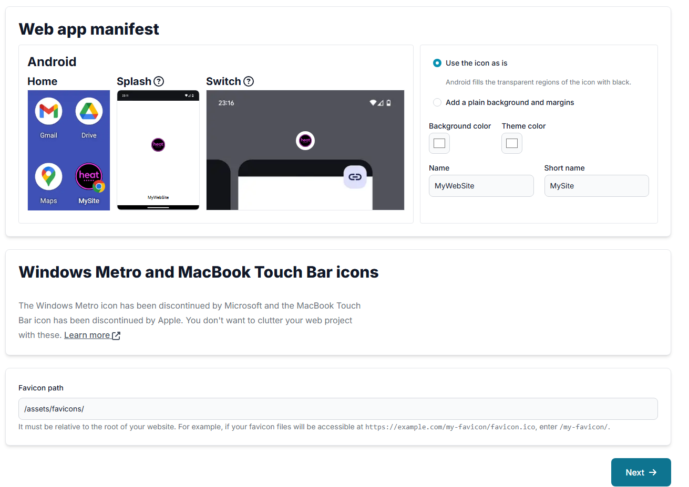
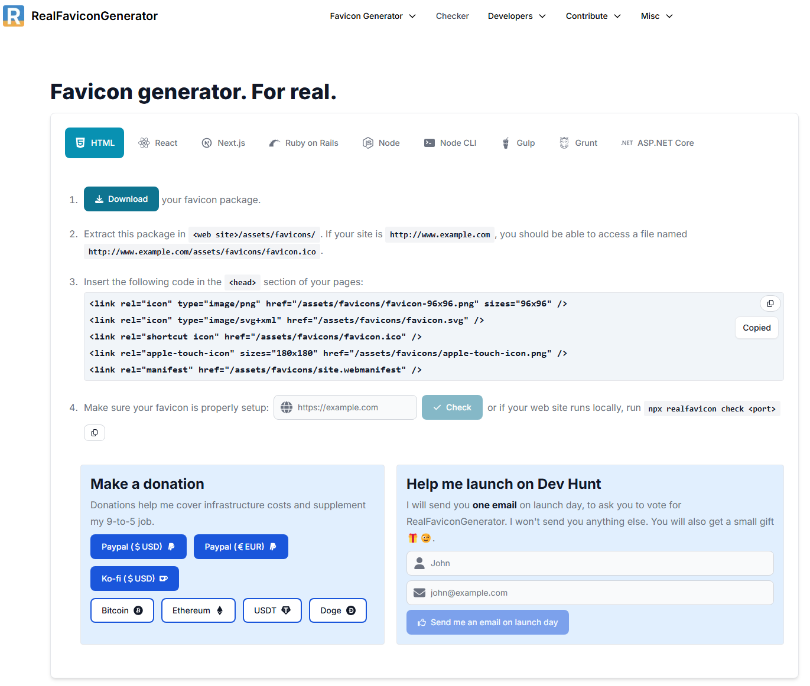

  

   
   

<h1 align="center">
  
  Milestone Project 1: Heat
</h1>

<h3 align="center">
  <em><strong>A static website created for my band, designed to showcase our music, share upcoming events, and engage with our audience. Developed as part of the User Centric Frontend Development Milestone Project at Code Institute.</strong></em>
</h3>

 
 

## 👉 [Heat Website]()

 
 

## Table of Contents

1. ### [Project Overview](#project-overview) 📄
2. ### [User Experience Design](#user-experience-design) 🎯
   - #### [User Stories](#user-stories) 🧠
   - #### [Structure](#structure) 🧱
   - #### [Design](#design) 🎨
     - ##### [Wireframes](#wireframes) 🗺️
     - ##### [Colour Palette](#colour-palette) 🎨
     - ##### [Typography](#typography) ✍️
3. ### [Features](#features) ✨
4. ### [Technologies Used](#technologies-used) 🛠️
   - #### [Favicon Creation & Integration](#favicon-creation--integration) 🖼️
5. ### [Testing & Bug Fixes](#testing--bug-fixes) 🧪
6. ### [Deployment](#deployment) 🚀
7. ### [Credits](#credits) 🙏

---

## Project Overview

> A brief summary of the website and its purpose.  
> Who the target audience is, why the site exists, and what it represents for the band.

---

## User Experience Design

### User Stories

> - As a visitor, I want to listen to the band’s music, so I can discover their style.
> - As a fan, I want to find upcoming events easily, so I can attend their gigs.
> - As a venue owner, I want contact information, so I can book the band.

### Structure

> Description of the site’s layout and key sections (e.g. navbar, hero, gallery, contact...).

## Design

#### Wireframes

> Insert links or images of the wireframes.

#### Colour Palette

> List the colours used (with visual swatches if possible) and explain why they were chosen.

#### Typography

> Mention the fonts used (e.g. Google Fonts) and why they were selected.

---

## Features

> - Fully responsive layout
> - Audio embeds
> - Image gallery
> - Social media links
> - Custom favicon

---

## Technologies Used

- HTML5
- CSS3
- Bootstrap 5
- Git & GitHub
- Visual Studio Code

### Favicon Creation & Integration

To create a full set of favicons compatible with all major platforms (desktop, Android, iOS), I used the online tool [RealFaviconGenerator](https://realfavicongenerator.net).

**Steps:**

1. Uploaded the custom Heat logo.
2. Used default settings for modern browser and mobile support.
3. Extracted files into `assets/favicons/`.
4. Added the generated `<link>` tags to the `<head>` of `index.html`.

**Screenshots:**

- **Favicon Generator Setup**  
  

- **Apple Touch Icon & Android Manifest**  
  

- **Export Settings & Folder Structure**  
  

---

## Testing & Bug Fixes

> Describe manual testing on different devices and browsers.  
> Mention tools used to validate HTML and CSS (e.g. [W3C Validator](https://validator.w3.org/), [Jigsaw](https://jigsaw.w3.org/css-validator/)).  
> Include any known bugs, how they were fixed, or why they remain unresolved.

---

## Deployment

> This site is deployed using GitHub Pages.  
> Include a live link and cloning instructions:

## Credits
