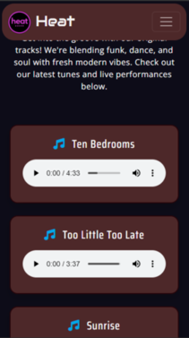
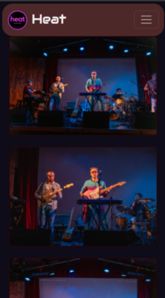
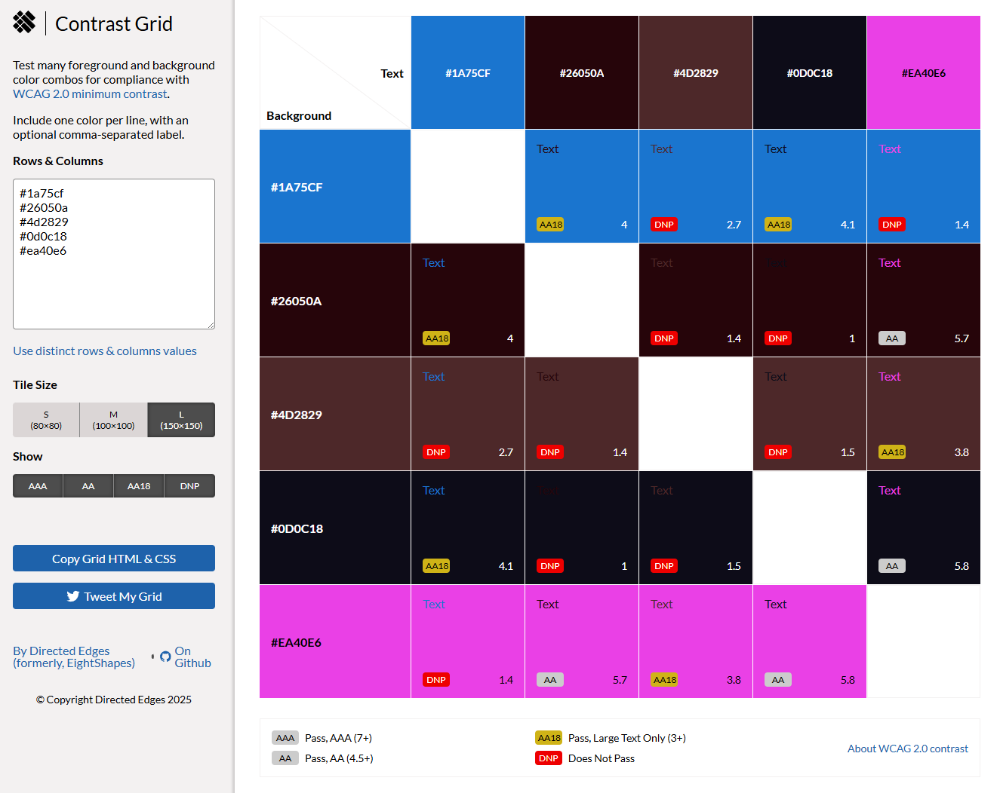

  

  <br>
  <br>

<h1 align="center">
  
  Milestone Project 1: Heat
</h1>

<h3 align="center">
  <em><strong>A static website created for my band, designed to showcase our music, share upcoming events, and engage with our audience. Developed as part of the User Centric Frontend Development Milestone Project at Code Institute.</strong></em>
</h3>

<br>
<br>

## 👉 [Heat Website](https://drake-designer.github.io/Heat/)


<br>
<br>

## Table of Contents

1. ### [Project Overview](#project-overview) 📄
2. ### [User Experience Design](#user-experience-design) 🎯
   - #### [User Stories](#user-stories) 🧠
   - #### [Structure](#structure) 🧱
   - #### [Design](#design) 🎨
     - ##### [Wireframes](#wireframes) 🗺️
     - ##### [Colour Palette](#colour-palette) 🎨
     - ##### [Typography](#typography) ✍️
3. ### [Features](#features) ✨
4. ### [Technologies Used](#technologies-used) 🛠️
   - #### [Favicon Creation & Integration](#favicon-creation--integration) 🖼️
5. ### [Testing & Bug Fixes](#testing--bug-fixes) 🧪
6. ### [Validation](#validation) ✅
7. ### [Deployment](#deployment) 🚀
8. ### [Credits](#credits) 🙏

---

## Project Overview

### Intro

Welcome to the official website of Heat: we are a group of friends who play fun and groovy dance-funk music. Our sound is inspired by bands like Daft Punk, Chromeo and Franc Moody.. full of energy, rhythm and good vibes!

We all share a strong passion for music and enjoy listening to the same styles, so playing together felt natural from the start. Over time, we’ve played in local venues, recorded our songs, and grown closer as a team. I made this website to share our music with more people, show where we’re playing next, and make it easy for anyone to book us for a show.

Whether you want to listen, learn more about us, or come see us live.. this is the right place!

### Scope

I have built this website as my first Milestone Project 1 for the Full Stack Web Development course at Code Institute. The idea was to create something real and personal, so I have choses to build a site for my band, Heat.

The main goal of this website is to help more people discover our music, check out our upcoming gigs, and get in touch if they want to book a ticket for a gig. Whether you're a fan, a curious listener, or someone looking to book a band, this site is the place to find everything about Heat.

The site gives visitors a clear idea of who we are, what kind of music we play, and where they can see us live. It also allows fans and event organizers to book us directly.

The site includes the following core features:

- A short introduction about the band

- A Music and Video section where users can listen to some of our songs and watch a few live performance clips

- A Photo Gallery to showcase pictures made during our gigs

- A section for Upcoming Gigs, where users can check where and when we’re playing next

- A Contact page to reach out for questions, messages, or booking requests

## User Experience Design

During the UX planning phase, I used the 5 UX Planes and Design Thinking process to define user needs and structure the site accordingly.

**Primary users:**

- Music lovers looking for new original dance/funk bands
- Venue owners interested in booking bands
- Fans and curious visitors wanting to explore our music

**Problems they face:**

- No clear way to discover or listen to our music
- Difficulty finding gig dates or contact info
- No professional booking method

**Goals:**

- Showcase Heat's identity and sound
- Promote our gigs and original songs
- Provide a clear, professional way to book us


### User Stories

- As a new visitor, I want to learn what kind of music the band plays, so I can decide if I like their style

- As a fan, I want to see upcoming gigs, so I can plan to attend their live shows

- As someone interested in booking the band, I want to find contact details or a booking button easily

- As a curious user, I want to explore photos and videos of past performances, so I can see what the live vibe is like

- As a music lover, I want to listen to samples or clips of the band’s original songs

- As a mobile user, I want the site to be easy to use on my phone or tablet

### Structure

The website has one main index page that includes three key sections, plus two extra pages:

#### Heat (Home)

The homepage is made up of three sections that visitors can easily access through the navbar:

- **The Band** – A short introduction about who we are, how we started, and the kind of music we play
- **Music** – A section where users can listen to some of our original songs and watch live performance videos
- **Gallery** – A photo section with snapshots from our gigs

These sections are all part of the same page and use anchor links to scroll smoothly to the right spot.

#### Upcoming Gigs

This page displays a list of our upcoming concerts, with details like the date, venue name, and location. At the top of the page (in the header), there’s a **"Book your spot!"** modal button that allows users to reserve tickets for future gigs.

I decided to place the button only in the header and used `visibility: hidden` to hide it from the navbar, so it wouldn’t appear twice.

#### Contact

A simple contact page with a message form and our contact info, so people can easily reach out for bookings, questions, or just to say hello.

> The entire site is fully responsive and works well on all screen sizes. The layout is clear, friendly, and reflects the fun personality of the band.

## Design

#### Wireframes

To plan the layout of my website, I used [Balsamiq](https://balsamiq.com/) to create wireframes for different screen sizes. This helped me decide where to place key elements like the logo, navbar, hero image, and text sections.

I made four wireframes, each showing how the site should look on different devices:

- **Desktop**
- **iPad**
- **iPhone SE**
- **Samsung Galaxy S20 Ultra**

Each wireframe includes the same features:

- A simple navbar with links
- A hero section with text and image
- A short band description
- An image carousel

These designs helped me make sure the site looks good and works well on both desktop and mobile devices.


#### Colour Palette

For this project, I decided to create a custom colour palette by manually picking colours from one of our band photos.

I used an online image color picker to extract the main tones directly from a live performance picture. This helped me build a palette that really feels connected to our style, our stage lights, and the atmosphere of our gigs.

Here are the colours I chose:

```css
/* Colour Palette */
--color-button-accent: #1a75cf; /* Deep blue - used for buttons */
--color-border: #26050a; /* Deep burgundy - used for borders and small accents */
--color-navbar-background: #4d2829; /* Rich dark red - used as the main navbar background */
--color-main: #0d0c18; /* Nearly black - used as the main page background */
--color-logo: #ea40e6; /* Bright purple - used in the logo for contrast and pop */
```


#### Typography

For this project, I used a combination of four different [Google Fonts](https://fonts.google.com/) to give the website a modern, clean, and slightly 'funky' style.

Each font was picked for a specific role:

- **Montserrat** – Used as the main body font for most text content
- **Open Sans** – Used for extra readability where needed
- **Saira Condensed** – Used in headings for a bold and sharp look
- **Audiowide** – Used only for the logo, to give it a unique and musical feel

All fonts are imported from Google Fonts and declared as custom variables in the `:root` selector for easier management across the site.

```css
/* Google Fonts ---> Montserrat + Open Sans + Saira Condensed + Audiowide */

@import url('https://fonts.googleapis.com/css2?family=Audiowide&family=Montserrat:ital,wght@0,100..900;1,100..900&family=Open+Sans:ital,wght@0,300..800;1,300..800&family=Saira+Condensed:wght@100;200;300;400;500;600;700;800;900&display=swap');

/* Typography */
:root {
  --font-primary: 'Montserrat', sans-serif;
  --font-secondary: 'Open Sans', sans-serif;
  --font-headings: 'Saira Condensed', sans-serif;
  --font-logo: 'Audiowide', cursive;
}
```

---

## Features

This website includes the following key features:

- **Fully responsive layout** – Works smoothly on desktop, tablet, and mobile devices
- **Anchor-based navigation** – The homepage uses anchor links to scroll between sections
- **Embedded audio players** – Visitors can listen to our original songs directly on the site
- **Live performance videos** – Watch us in action with video clips from past gigs
- **Photo gallery** – A collection of images from our shows
- **Upcoming gigs section** – A dedicated page listing future shows with dates and venues
- **"Book your spot!" modal button** – A call-to-action to reserve tickets for upcoming concerts
- **Contact form** – Simple form to get in touch for bookings or questions
- **Custom favicon and logo** – Designed to reflect our style and brand
- **Dark theme with custom colour palette** – Inspired by the lights and mood of our live shows
- **Clean, modern typography** – Using a mix of Google Fonts for headings, text, and logo

---

## Technologies Used

This project was built using the following tools and technologies:

- [**HTML5**](https://developer.mozilla.org/en-US/docs/Web/Guide/HTML/HTML5) – For structuring the content of the pages
- [**CSS3**](https://developer.mozilla.org/en-US/docs/Web/CSS) – For styling the layout, colours, fonts, and responsiveness
- [**Bootstrap 5**](https://getbootstrap.com/) – For responsive design and reusable components like navbar, grid, and buttons
- [**GitHub**](https://github.com/) – For version control and project hosting via GitHub Pages
- [**Visual Studio Code**](https://code.visualstudio.com/) – The main code editor used during development

Design & Media Tools:

- [**Balsamiq**](https://balsamiq.com/) – Used to create wireframes for different screen sizes
- [**Google Fonts**](https://fonts.google.com/) – For importing and using custom fonts like Montserrat, Audiowide, etc.
- [**RealFaviconGenerator**](https://realfavicongenerator.net/) – Used to generate a full set of favicons for multiple devices
- [**Squoosh**](https://squoosh.app/) – For compressing and optimizing images for faster load times. I used Squoosh to reduce the file size of all images without losing quality. This helped the website load faster, especially on mobile devices. I mostly exported images as `.webp` format and adjusted compression to balance quality and performance.

- [**HandBrake**](https://handbrake.fr/) – Used to compress and convert video files into web-friendly formats. I used HandBrake to reduce the file size of my video clips while keeping good quality. This helped improve page load time without losing the vibe of our live performances.

- [**Online Audio Converter**](https://online-audio-converter.com/) – To convert audio files into `.mp3` format for the music section. I used this online tool to convert `.wav` files into high-quality `.mp3` at 320 kbps, which helped reduce file size while keeping good sound quality.

### Favicon Creation & Integration

To create a full set of favicons compatible with all major platforms (desktop, Android, iOS), I have used the online tool [RealFaviconGenerator](https://realfavicongenerator.net).

**Steps:**

1. Uploaded the custom Heat logo.
2. Used default settings for modern browser and mobile support.
3. Extracted files into `assets/favicons/`.
4. Added the generated `<link>` tags to the `<head>` of `index.html`.

<br>


## Testing & Bug Fixes

### 🧪 Lighthouse Performance Testing

To check the overall performance and quality of the website, I used the [Lighthouse tool](https://developer.chrome.com/docs/lighthouse/overview/) built into Chrome DevTools. This tool evaluates key areas such as performance, accessibility, and best practices.

I ran the Lighthouse audit on the **live deployed site** in **Incognito mode**, to avoid interference from browser extensions or cached data:

👉 [https://drake-designer.github.io/Heat/](https://drake-designer.github.io/Heat/)

#### 🖥️ Desktop results:

- **Performance:** 98
- **Accessibility:** 100
- **Best Practices:** 100


<br>

#### 📱 Mobile results:

- **Performance:** 74
- **Accessibility:** 100
- **Best Practices:** 100


Although the performance score is slightly lower on mobile devices, this is common for media-rich websites. To optimise load speed and responsiveness, I have:

- Compressed all images using [Squoosh](https://squoosh.app/)
- Converted large images to `.webp` format
- Reduced video file sizes with [HandBrake](https://handbrake.fr/)

These optimisations helped the site maintain excellent results in accessibility and best practices, with solid performance overall.

### ♿ Accessibility Testing with WAVE

To check if my website is accessible for all users, I used the [WAVE Web Accessibility Evaluation Tool](https://wave.webaim.org/).

This tool checks if the site is easy to use for people with different abilities — for example, using screen readers, keyboard navigation, or high contrast settings.

Here are the results:

- ✅ **0 Errors**
- ✅ **0 Contrast Errors**
- ⚠️ **11 Alerts** (mostly related to redundant ARIA attributes and landmark roles)
- ✅ **All main headings, alt text, and structure were recognised correctly**


These results show that the website follows accessibility best practices.  
There are no major issues, but manual testing is still important to be sure everything works well for everyone.

### ❌ Bug #1 – Anchor links didn't scroll to the correct section

When clicking on the navigation links like "The Band", "Music", or "Gallery", the scroll did not work properly. Sometimes the section was too high and hidden behind the navbar, and other times it was too low.

This problem made the site feel broken, especially on small screens or when using the mobile menu. It was hard to understand what caused it. I lost almost a full day trying different ideas and also contacted Tutor Support for help.

In the end, the solution was very simple. I added the following CSS to give the body and section elements enough padding from the top, equal to the height of the navbar (72.89px):

body {
padding-top: 72.89px;
}

section {
padding-top: 72.89px;
}

📸 Screenshots – Before the Fix





📸 Screenshots – After the Fix


### ❌ Bug #2 – Low colour contrast in site-wide palette (general issue)

While working on the site, I noticed that some text and buttons were not easy to read because the colours didn’t have enough contrast. This was more noticeable on small screens or in dark environments.

To check and fix this, I used [Contrast Grid](https://contrast-grid.eightshapes.com/) to test all the colours I used. This tool helps make sure that text is easy to read and follows the [WCAG 2.0](https://www.w3.org/TR/WCAG20/) accessibility rules.

Here is the result of the test:



### ❌ Bug #3 – Low contrast on primary button (specific UI issue)

While testing the site for accessibility using the WAVE evaluation tool and the WebAIM Contrast Checker, I noticed that the main call-to-action buttons (like "Book your spot!") didn’t have enough contrast between the background color and the white text.

The original CSS value for the button color was:

```css
--color-button-accent: #00a7e8; /* Bright electric blue - used for buttons */
```

Even though the color looked nice, it wasn’t easy to read, especially for people with vision problems or in dark environments.

🛠️ Fix:

To solve this, I updated the color to a darker and more accessible shade of blue:

```css
--color-button-accent: #1a75cf; /* Deep blue - used for buttons */
```

> **Note:** The old color `#00a7e8` is not shown in the grid below, but it had a very low contrast ratio and did not meet WCAG guidelines. The new color `#1a75cf` is included and passes the test. Most important text and background combinations in the palette meet the WCAG 2.1 AA contrast standard. Some darker color pairs do not pass, but they are only used for decorative elements or areas without text, so they do not affect too much accessibility.

## Validation

To make sure my code was clean and followed best practices, I tested my HTML and CSS using the following online validation tools:

- [W3C Markup Validator](https://validator.w3.org/#validate_by_input) – to check for any HTML errors or missing elements
- [W3C CSS Validator](https://jigsaw.w3.org/css-validator/#validate_by_input) – to check for any CSS mistakes or incorrect rules
- [Autoprefixer](https://autoprefixer.github.io/) – to add vendor prefixes automatically for better browser compatibility

All my HTML code passed validation successfully, with the exception of some small warnings. These were "info-level" messages about the use of self-closing tags (e.g. `<meta />`, ``, `<input />`).

> **These warnings were caused by the Prettier extension in VS Code, which automatically formats empty tags with a `/` at the end. This syntax is valid in XHTML but not required in HTML5. The code still works perfectly in all browsers and does not cause display issues or accessibility problems.**

My CSS passed validation as well. However, after using Autoprefixer, the validator showed a few expected warnings:

- Some vendor prefixes like `-webkit-`, `-ms-`, or `-o` were automatically added to support different browsers
- Some warnings said that CSS variables (like `var(--example)`) could not be statically checked
- The `@import` line for Google Fonts is ignored by the validator, which may cause a note at the top

> These are not errors and do not affect how the website works and all styles and features display correctly on modern browsers.

## Deployment

The website was deployed early in the project, right after the home page (HTML and CSS) was set up and tested.

Deployment was done using GitHub Pages, directly from the main branch of the repository.

### 🌐 Live Site

You can view the live project here:  
👉 [https://drake-designer.github.io/Heat/](https://drake-designer.github.io/Heat/)

### 🔧 How Deployment Was Done

1. Opened the GitHub repository for the project
2. Clicked on the `Settings` tab at the top of the page
3. From the sidebar on the left, selected the **Pages** section
4. In the **Branch** section:
   - Chose `main` as the source
   - Selected `/ (root)` as the folder
5. Clicked **Save**
6. After a few seconds, GitHub provided a live link to the deployed site

### 💻 How to Clone This Repository Locally

If you'd like to clone this project and work on it locally, follow these steps:

1. Go to the repository page:  
   👉 [https://github.com/drake-designer/Heat](https://github.com/drake-designer/Heat)

2. Click the green **Code** button

3. Copy the URL shown (it should look like `https://github.com/username/repo-name.git`)

4. Open your terminal and change directory to where you want to store the project

5. Type the following command and press Enter:
   ```bash
   git clone https://github.com/drake-designer/Heat.git
   ```

## Credits

### 👨‍🏫 Walkthrough Project Inspiration – _Boardwalk Games_

A big part of the layout and structure of my website was inspired by one of the guided projects from the course:

**Boardwalk Games**  
👉 GitHub: [Boardwalk-Games](https://github.com/Drake-Designer/Boardwalk-Games)  
👉 Course Link: [Code Institute – Boardwalk Project](https://learn.codeinstitute.net/courses/course-v1:CodeInstitute+BG+2/courseware/21d4dc3fa8f0407a8359ceb1d6fc0c51/c113d413c91d4d789399ce5b1303f2fa/)

This was one of the most fun and helpful parts of the course for me. Thanks to this project, I was able to learn and then use **Bootstrap** properly, and I really enjoyed working with it! I used that knowledge to build the layout of my own project and adapted it for my band website.

One specific part of the JavaScript was copied directly from the Boardwalk Games project:

```html
<!-- Bootstrap JS mobile navbar -->
<script defer>
  document.querySelectorAll('.navbar-collapse .nav-link').forEach((link) => {
    link.addEventListener('click', function (e) {
      let section = document.querySelector(e.target.getAttribute('href'));
      if (section) {
        e.preventDefault();
        let navbarHeight = document.querySelector('.navbar-toggler').offsetHeight;
        window.scroll({
          top: section.offsetTop - navbarHeight,
          behavior: 'smooth',
        });
        document.querySelector('.navbar-collapse').classList.remove('show');
      }
    });
  });
</script>
```

Without this guided project, I wouldn’t have been able to use Bootstrap the way I did or build this site the way I imagined it (and honestly, I really like how it turned out... and I hope you do too! 😄)

> A big thank you and full credit goes to **Jo Heyndels** , the creator of the Boardwalk Games walkthrough project!!!

<br>

### 🎵 Visual Inspiration – _Azure Band Website_

Another source of inspiration for this project was the website of an Irish band based in Dublin: [https://www.azureband.ie/](https://www.azureband.ie/)

I didn’t take any code from their site, I only looked at the visual style and took inspiration from their layout and design choices.

In particular:

- I liked how their hero image is placed on the right, with a subtle animation effect. I used a similar idea in my own site by creating a custom animation with CSS keyframes.
- The idea of having three main sections ("The Band", "Music", and "Gallery") all in a single scrolling page also came from them. I thought it was a smart way to keep the site clean and easy to navigate.
- The colour scheme ended up looking a bit similar too, but that was just a coincidence. I created my palette by picking colours from one of our own gig photos.

So even if I didn’t reuse anything from their code, their website was definitely a useful visual reference while building mine.
