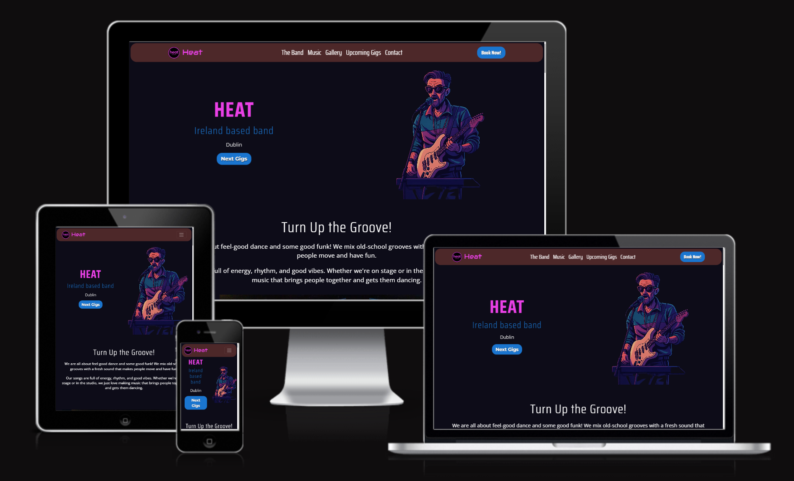
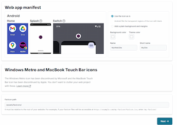

  

   
   

<h1 align="center">
  
  Milestone Project 1: Heat
</h1>

<h3 align="center">
  <em><strong>A static website created for my band, designed to showcase our music, share upcoming events, and engage with our audience. Developed as part of the User Centric Frontend Development Milestone Project at Code Institute.</strong></em>
</h3>

 
 

## 👉 [Heat Website](https://drake-designer.github.io/Heat/)

 
 

## Table of Contents

1. ### [Project Overview](#project-overview) 📄
2. ### [User Experience Design](#user-experience-design) 🎯
   - #### [User Stories](#user-stories) 🧠
   - #### [Structure](#structure) 🧱
   - #### [Design](#design) 🎨
     - ##### [Wireframes](#wireframes) 🗺️
     - ##### [Colour Palette](#colour-palette) 🎨
     - ##### [Typography](#typography) ✍️
3. ### [Features](#features) ✨
4. ### [Technologies Used](#technologies-used) 🛠️
   - #### [Favicon Creation & Integration](#favicon-creation--integration) 🖼️
5. ### [Testing & Bug Fixes](#testing--bug-fixes) 🧪
6. ### [Deployment](#deployment) 🚀
7. ### [Credits](#credits) 🙏

---

## Project Overview

### Intro

Welcome to the official website of Heat: we are a group of friends who play fun and groovy dance-funk music. Our sound is inspired by bands like Daft Punk, Chromeo and Franc Moody.. full of energy, rhythm and good vibes!

We started this band for the love of music and performing live gigs. Over time, we’ve played in local venues, recorded our songs, and grown closer as a team. I made this website to share our music with more people, show where we’re playing next, and make it easy for anyone to book us for a show.

Whether you want to listen, learn more about us, or come see us live: this is the right place!

### Scope

I have built this website as my first Milestone Project 1 for the Full Stack Web Development course at Code Institute. The idea was to create something real and personal, so I have choses to build a site for my band, Heat.

The main goal of this website is to help more people discover our music, check out our upcoming gigs, and get in touch if they want to book a ticket for a gig. Whether you're a fan, a curious listener, or someone looking to book a band, this site is the place to find everything about Heat.

The site gives visitors a clear idea of who we are, what kind of music we play, and where they can see us live. It also allows fans and event organizers to book us directly.

The site includes the following core features:

- A short introduction about the band

- A Music and Video section where users can listen to some of our songs and watch a few live performance clips

- A Photo Gallery to showcase pictures made during our gigs

- A section for Upcoming Gigs, where users can check where and when we’re playing next

- A Contact page to reach out for questions, messages, or booking requests

These features make sure that users can learn about us, enjoy our content, and easily reach out to us.

## User Experience Design

### User Stories

- As a new visitor, I want to learn what kind of music the band plays, so I can decide if I like their style

- As a fan, I want to see upcoming gigs, so I can plan to attend their live shows

- As someone interested in booking the band, I want to find contact details or a booking button easily

- As a curious user, I want to explore photos and videos of past performances, so I can see what the live vibe is like

- As a music lover, I want to listen to samples or clips of the band’s original songs

- As a mobile user, I want the site to be easy to use on my phone or tablet

### Structure

## Design

#### Wireframes

To plan the layout of my website, I used [Balsamiq](https://balsamiq.com/) to create wireframes for different screen sizes. This helped me decide where to place key elements like the logo, navbar, hero image, and text sections.

I made four wireframes, each showing how the site should look on different devices:

- **Desktop**
- **iPad**
- **iPhone SE**
- **Samsung Galaxy S20 Ultra**

Each wireframe includes the same features:

- A simple navbar with links
- A hero section with text and image
- A short band description
- An image carousel

These designs helped me make sure the site looks good and works well on both desktop and mobile devices.

#### Colour Palette

#### Typography

---

## Features

> - Fully responsive layout
> - Audio embeds
> - Image gallery
> - Social media links
> - Custom favicon

---

## Technologies Used

- HTML5
- CSS3
- Bootstrap 5
- GitHub
- Visual Studio Code

### Favicon Creation & Integration

To create a full set of favicons compatible with all major platforms (desktop, Android, iOS), I have used the online tool [RealFaviconGenerator](https://realfavicongenerator.net).

**Steps:**

1. Uploaded the custom Heat logo.
2. Used default settings for modern browser and mobile support.
3. Extracted files into `assets/favicons/`.
4. Added the generated `<link>` tags to the `<head>` of `index.html`.

 

## Testing & Bug Fixes

❌ Bug #1 – Anchor links didn't scroll correctly to the right section

When clicking on the navigation links like "The Band", "Music", or "Gallery", the scroll did not work properly. Sometimes the section was too high and hidden behind the navbar, and other times it was too low.

This problem made the site feel broken, especially on small screens or when using the mobile menu. It was hard to understand what caused it. I lost almost a full day trying different ideas and also contacted Tutor Support for help.

In the end, the solution was very simple. I added the following CSS to give the body and section elements enough padding from the top, equal to the height of the navbar (72.89px):

body {
padding-top: 72.89px;
}

section {
padding-top: 72.89px;
}

📸 Screenshots – Before the Fix

📸 Screenshots – After the Fix

## Deployment

## Credits
